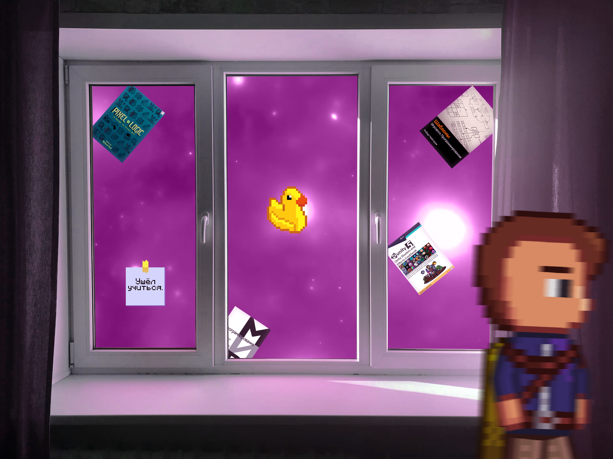

  
  
  

    
    
    
    
  

  
  

---

  

---

### :computer: About Me :
I am (almost) a Full Stack Developer from Russia. Me name is Savva and I'm is a high school student.
- 👀 I’m interested in math and game development
- 🤓 I'm good in Python 3
- 🔭 I’m mainly working on my game "Portal Dimenshions"
- 👯 I’m looking to collaborate with any dude, who shares my view and ideas
- 🌱 I’m currently learning C#
- 🤔 I’m looking for help with visual for my games
- 📫 To contact me, you can write here: savvazhirnov@yandex.ru

---

### :hammer_and_wrench: Languages and Tools:

  &nbsp;
  &nbsp;
  &nbsp;
  &nbsp;
  &nbsp; 
  &nbsp; 
  &nbsp; 
  &nbsp; 
  &nbsp; 
  &nbsp; 
  &nbsp; 
  &nbsp; 
  &nbsp; 

---

### :bar_chart: My Stats :

 

